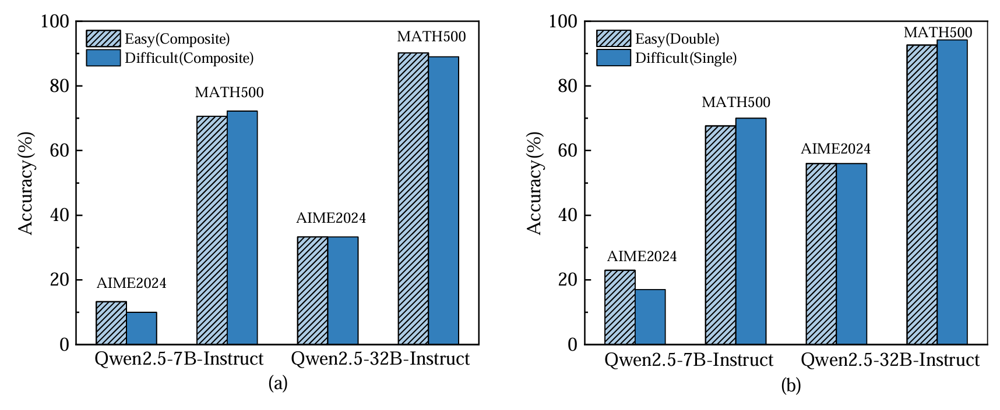
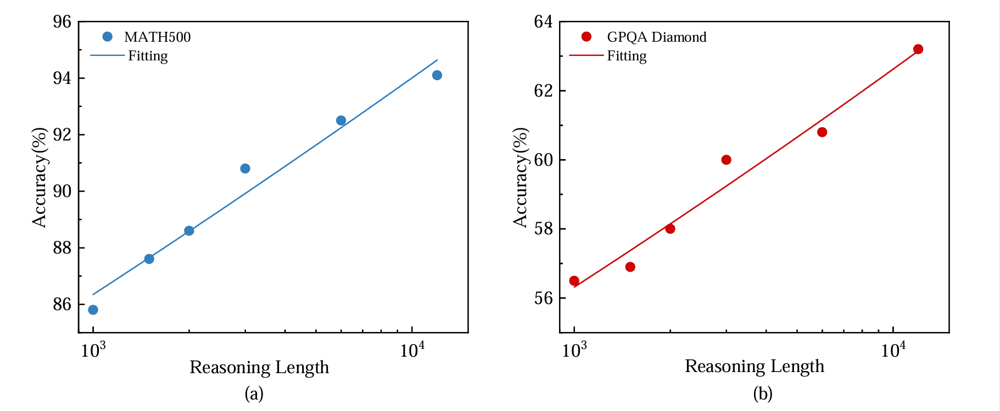
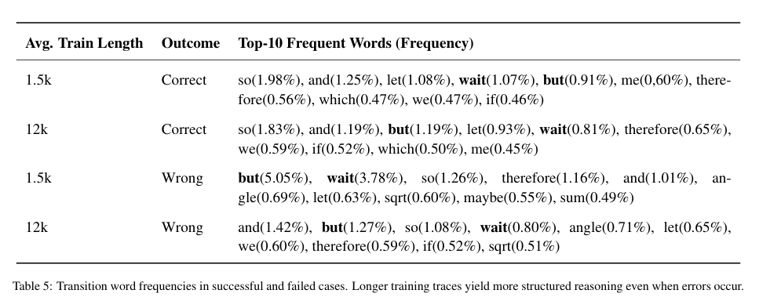
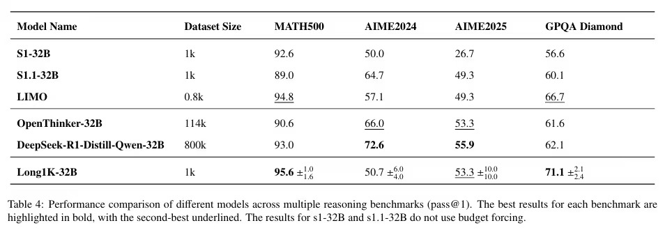

# Model Description


 Difficult problems, which often result in long reasoning traces, are widely recognized as key factors for enhancing the performance of reasoning models. However, such high-challenge problems are scarce, limiting the size of available datasets. In this paper, we propose a simple method to decouple the reliance on problem difficulty. First, we empirically demonstrate that reasoning length, rather than problem difficulty, primarily influences the performance of trained models. Second, we identify a scaling law on reasoning length, showing that model performance increases in a log-linear fashion as the reasoning data length grows. Finally, we introduce a straightforward technique to generate reasoning data of arbitrary length, and show that synthesized data is effective for training reasoning models. After fine-tuning the Qwen2.5-32B-Instruct language model on our Long1K dataset, we present our model, Long1K-32B, which achieves remarkable performance with only 1,000 training samples, achieving 95.6% accuracy on MATH, and 71.1% on GPQA outperforming DeepSeek-R1-Distill-Qwen-32B.
1. Challenging a common assumption: We demonstrate through controlled experiments that reasoning length, rather than problem difficulty, is the key factor in training effective reasoning models.
2. Identifying a scaling law on reasoning length: We show that model performance improves nearly linearly with the logarithm of reasoning trace length, highlighting reasoning length as a new scaling dimension.
3. Developing a simple synthesis strategy: We propose an efficient method to generate arbitrarily long reasoning sequences, releasing the Long1K dataset and Long1K-32B model to support further research.
4. Providing new insights into reasoning model behavior: We conduct in-depth analysis showing that longer training reasoning sequences improve structural coherence, enhance instruction-following ability across long contexts, and yield more efficient scaling than inference-only strategies.


# Detail

Conventional wisdom suggests difficult problems are crucial for training reasoning models. However, it's unclear whether problem difficulty or reasoning length is the key factor. We conducted experiments to separate these factors: (1) keeping difficulty constant while varying length, and (2) keeping length constant while varying difficulty. 

(1) keeping difficulty constant while varying length: To investigate this, we used identical problems with varying solution lengths, divided into four sets based on solution length.


   (2) keeping length constant while varying difficulty: we design datasets where “easier” problems are made longer by adding multiple sub-questions, whereas  “difficult” problems are inherently complex but contain only a single question. This ensures both sets have similar token lengths in their solution traces but differ in intrinsic difficulty.




  Therefore, we shifted our focus from the difficulty of mathematical problems to the length of mathematical problems. We made the assumption that length is the key factor in constructing inference models. To this end, we explored the effect of different tokens lengths on the reasoning ability of the model at the same difficulty level. Firstly, we classify the token length into 6 levels, whose lengths are 1k,1.5k,2k,3k,6k,12k. Then, we set the number of questions to 500, and conduct experimental validation on Qwen2.5-32B model. The results are shown below. The data show that on the math500 dataset, the performance is close to linearly increasing as the length increases.



  In addition, we compared the reasoning processes of two models trained with reasoning lengths of 1.5k and 12k, respectively, on the MATH500 test set, including both successful and failed reasoning attempts. Our analysis included statistical comparisons of the average reasoning token length and the top 10 most frequently used words during reasoning. The goal was to understand why the model trained with a reasoning length of 12k achieved an accuracy improvement of over 5%.




# Training Data
  We conducted relevant experiments using our own synthesized [Long1K] dataset. Long1K is a composite data generated for model training from two datasets, Openthouhts114k and s1.1. Specifically, on one hand, we randomly select two mathematical problems from Openthouhts114k. The problems, reasoning processes, and results of these two mathematical problems are concatenated together using different linking words to increase the length of the prompts. On the other hand, in order to avoid overfitting of the model to two mathematical problems and improve its robustness, we also extracted a certain number of mathematical problems that meet the length requirements from the s1.1 dataset and fused them into Long1k. Ultimately, the synthetic data Long1k used for model training will consist of these two parts of data. Of course, in different experiments, the ratio of the length of the two parts of the problem and the number of markers will be dynamically adjusted according to the experimental requirements.


# Evaluation



Performance comparison of different models across multiple reasoning benchmarks (pass@1). The best results for each benchmark are highlighted in bold, with the second-best underlined. The data for s1 does not use budget forcing, and the data for s1.1 that does not use budget forcing comes from Open Thoughts.


# Uses
The Long1K-32B model file has been uploaded here. If you want to use it, please download it [here]. We have uploaded our reasoning and evaluation scripts. If you are interested in using it, please follow the steps below.

  ## Requirement
```
  pip install -r requirements.txt
```
  ## Reasoning
  After downloading the model, please use the following code to perform result inference.
```
  bash predict.sh
```


  ## Evaluation
  Use the following code to calculate indicators.
```
  python calc_metric_lc.py
```
