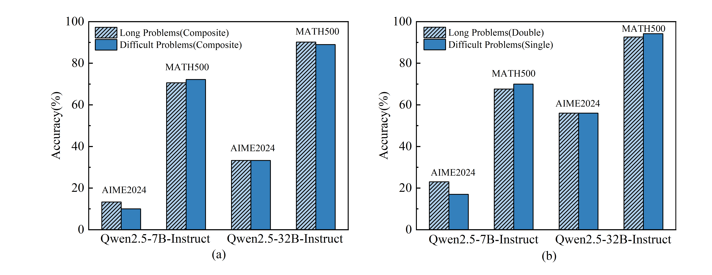
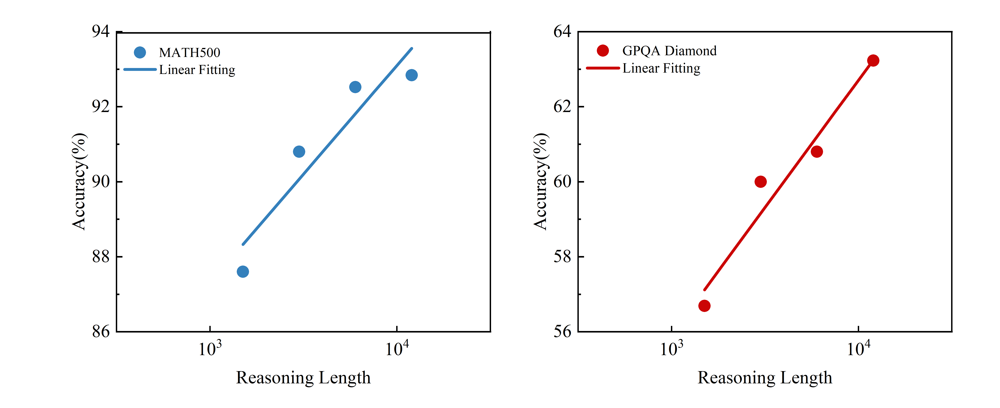

# Model Description


 Difficult problems, which often result in long reasoning traces, are widely recognized as key factors for enhancing the performance of reasoning models. However, such high-challenge problems are scarce, limiting the size of available datasets. In this paper, we propose a simple method to decouple the reliance on problem difficulty. First, we empirically demonstrate that reasoning length, rather than problem difficulty, primarily influences the performance of trained models. Second, we identify a scaling law on reasoning length, showing that model performance increases in a log-linear fashion as the reasoning data length grows. Finally, we introduce a straightforward technique to generate reasoning data of arbitrary length, and show that synthesized data is effective for training reasoning models. After fine-tuning the Qwen2.5-32B-Instruct language model on our Long1 dataset, we present our model, Long1-32B, which achieves remarkable performance with only 1,000 training samples, achieving 95.6% accuracy on MATH, and 71.1% on GPQA outperforming DeepSeek-R1-Distill-Qwen-32B.
1. Challenging a common assumption: We question the prevalent belief that problem difficulty is the most critical factor. Instead, our experiments suggest that reasoning length is key to training high-performance reasoning models. This insight allows us to build large-scale, long-reasoning datasets without being constrained by the rarity of extremely difficult problems.
2. Identifying a scaling law on reasoning length: We observe that model performance improves nearly linearly as the length of training data increases exponentially. This phenomenon highlights the efficiency gains achievable by focusing on the length of reasoning sequences.
3. Proposing a simple synthesis method: We introduce a technique to generate arbitrarily long reasoning data. Using this method, we release the Long1K dataset, upon which our Long1K-32B model is fine-tuned. This model surpasses existing baselines on benchmarks such as MATH500 and GPQA Diamond, demonstrating that extended reasoning sequences can significantly enhance model performance.


# Detail

  Among the work of the thesis, we firstly did two sets of experiments, namely, conceptual synthetic long problems with conceptual synthetic difficult problems, and synthetic long problems with original difficult problems. The related results are shown in the following figure. It turns out that the models perform similarly in mathematical reasoning when the training token lengths are similar. We make a conclusion that the key factor affecting the model's reasoning effectiveness is not the difficulty.




  Therefore, we shifted our focus from the difficulty of mathematical problems to the length of mathematical problems. We made the assumption that length is the key factor in constructing inference models. To this end, we explored the effect of different tokens lengths on the reasoning ability of the model at the same difficulty level. Firstly, we classify the token length into 4 levels, whose lengths are 1.5k,3k,6k,12k. Then, we set the number of questions to 500, and conduct experimental validation on Qwen2.5-32B model. The results are shown below. The data show that on the math500 dataset, the performance is close to linearly increasing as the length increases.



  In addition, we compared the reasoning processes of two models trained with reasoning lengths of 1.5k and 12k, respectively, on the MATH500 test set, including both successful and failed reasoning attempts. Our analysis included statistical comparisons of the average reasoning token length and the top 10 most frequently used words during reasoning. The goal was to understand why the model trained with a reasoning length of 12k achieved an accuracy improvement of over 5%.

| Dataset Size | Correct/Wrong | Average Tokens | Top 10 Frequently Occurring Words                                                                 |
|--------------|---------------|----------------|------------------------------------------------------------------------------------------------|
| 1.5k         | Correct       | 2147.65        | the(5.30%) is(3.24%) so(1.98%) of(1.45%) to(1.44%) and(1.25%) that(1.17%) let(1.08%) **wait(1.07%)** **but(0.91%)** |
| 12k          | Correct       | 4716.27        | the(4.92%) is(3.04%) so(1.83%) to(1.41%) of(1.25%) and(1.19%) **but(1.19%)** let(0.93%) that(0.90%) **wait(0.81%)** |
| 1.5k         | Wrong         | 8247.21        | **but(5.05%)** the(5.00%) **wait(3.78%)** is(3.24%) of(1.29%) so(1.26%) therefore(1.16%) to(1.08%) and(1.01%) that(0.70%) |
| 12k          | Wrong         | 15694.54       | the(5.12%) is(2.85%) to(1.64%) and(1.42%) **but(1.27%)** of(1.20%) so(1.08%) **wait(0.80%)** that(0.80%) in(0.75%) |


# Training Data
  We conducted relevant experiments using our own synthesized [LONG1k](https://huggingface.co/datasets/ZTss/LONG1k) dataset. LONG1k is a composite data generated for model training from two datasets, Openthouhts114k and s1.1. Specifically, on one hand, we randomly select two mathematical problems from Openthouhts114k. The problems, reasoning processes, and results of these two mathematical problems are concatenated together using different linking words to increase the length of the prompts. On the other hand, in order to avoid overfitting of the model to two mathematical problems and improve its robustness, we also extracted a certain number of mathematical problems that meet the length requirements from the s1.1 dataset and fused them into LONG1k. Ultimately, the synthetic data LONG1k used for model training will consist of these two parts of data. Of course, in different experiments, the ratio of the length of the two parts of the problem and the number of markers will be dynamically adjusted according to the experimental requirements.


# Evaluation

| Model | Dataset Size | MATH_500 | AIME_2024 | AIME_2025 | GPQA_Diamond |
|---|---|---|---|---|---|
| s1-32B | 1k | 92.6 | 50.0 | 26.7 | 56.6 |
| s1.1-32B | 1k | 89.0 | 64.7 | 49.3 | 60.1 |
| LIMO | 0.8k | <u>94.8</u> | 57.1 | 49.3 | <u>66.7</u> |
| OpenThinker-32B | 114k | 90.6 | <u>66.0</u> | <u>53.3</u> | 61.6 |
| DeepSeek-R1-Distill-Qwen-32B | 800K | 93.0 | **72.6** | **55.9** | 62.1 |
| Long1-32B | 1K | **95.6** | 50.7 | <u>53.3</u> | **71.1** |

Performance comparison of different models across multiple reasoning benchmarks (pass@1). The best results for each benchmark are highlighted in bold, with the second-best underlined. The data for s1 does not use budget forcing, and the data for s1.1 that does not use budget forcing comes from Open Thoughts.


# Uses
The LONG1-32B model file has been uploaded here. If you want to use it, please download it [here](https://huggingface.co/ZTss/LONG1k-32B). We have uploaded our reasoning and evaluation scripts. If you are interested in using it, please follow the steps below.

  ## Requirement
```
  pip install -r requirements.txt
```
  ## Reasoning
  After downloading the model, please use the following code to perform result inference.
```
  bash predict.sh
```


  ## Evaluation
  Use the following code to calculate indicators.
```
  python calc_metric_lc.py
```


- **Name**: Danhao Zhu
  **Email**: zhudanhao@jspi.cn
  **Organization**: Jiangsu Police Institute
  
